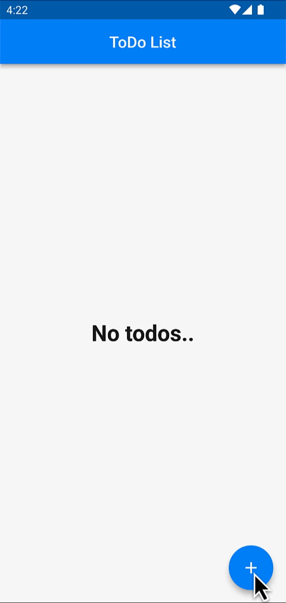

### 💖&ensp;Access Source Code [(FAQ)](https://github.com/JohannesMilke/sponsorware "FAQ")

You need to click [REQUEST](https://johannesmilke.com/#/request "REQUEST") first, before you will get access to [THIS Source Code](https://github.com/JohannesMilke-Sponsors/sqflite_example "THIS Source Code") and of all my other Flutter Videos.

&ensp;
    
# Flutter SQL Database Storage Using Sqlite & Sqflite CRUD
[][youtube]
[][twitter]
[][newsletter]

[][sponsor]
   

Persist data in Local Database of your Android or iOS device with Sqlite and Sqflite plugin. Using Raw SQL statements perform Sqflite CRUD Operations Create, Read, Update and Delete.

### ✌&ensp;Preview

|              App Preview             |             Course Preview           |
| :----------------------------------: | :----------------------------------: |
|  |  |

➜&ensp;[Buy My Courses](https://heyflutter.com "Buy My Courses")

### 📺&ensp;Watch Video

##### [YouTube video](https://www.youtube.com/watch?v=9kbt4SBKhm0 "Youtube HeyFlutter") where the *source code* is explained. [Subscribe YouTube channel.](https://www.youtube.com/@HeyFlutter?sub_confirmation=1 "YouTube Subscribe HeyFlutter")  

➜&ensp;[Watch My Video](https://www.youtube.com/watch?v=9kbt4SBKhm0 "Watch My Video")

### ⚡&ensp;Social Media

&ensp;YouTube: [@HeyFlutter](https://www.youtube.com/@HeyFlutter?sub_confirmation=1 "YouTube HeyFlutter")

&ensp;Twitter: [@HeyFlutter](https://twitter.com/intent/follow?original_referer=https%3A%2F%2Fgithub.com%2FHeyFlutter_&screen_name=HeyFlutter_ "Twitter HeyFlutter")

&ensp;Facebook: [@HeyFlutter](https://www.facebook.com/heyflutter "Facebook HeyFlutter")

&ensp;Instagram: [@HeyFlutter](https://instagram.com/HeyFlutter_ "Instagram HeyFlutter")

&ensp;LinkedIn: [@HeyFlutter](https://www.linkedin.com/company/heyflutter/ "LinkedIn HeyFlutter")

&ensp;Website: [@HeyFlutter](https://heyflutter.com "Website HeyFlutter")

[twitter]: https://twitter.com/intent/follow?original_referer=https%3A%2F%2Fgithub.com%2FHeyFlutter_&screen_name=HeyFlutter_
[youtube]: https://www.youtube.com/@HeyFlutter?sub_confirmation=1
[courses]: https://heyflutter.com
[newsletter]: https://johannesmilke.com/#/newsletter
[sponsor]: https://github.com/sponsors/JohannesMilke
